# Custom Portfolio


This site is a custom portfolio website aiming to showcase *abilities, talents, creativity* and *learning* that the author implements in the subsequent detailed projects available on the site. The content predominantly focuses on *web development* and *graphic design* and *blogging*.

My biggest motivation for this project is to create a *digital portfolio*. A site where I can **document my progress, experiences, challenges** and **learnings** in the projects I undertake in **web development** and **graphic design**. 

## UX

**Navigation** is a vital tool regarding access to content. Therefore being able to *navigate* through the content with ease is critical. This site has two navigation elements to navigate through the pages that make up the site. Please use the **primary navbar** at the top and the **breadcrumb navbar** at the footer of each page.

Below is a code snippet of the **primary navbar** that appears at *the top of each page*.

```

<!-- Top Navbar content starts here -->
    <nav aria-label="navbar" id="myPrimaryNavbar" class="navbar pt-pb pl-pr">
        <div class="brand-logo">
            <!-- Brand Logo Content starts here -->
            <a href="home.html">
                
            </a>
            <!-- Brand Logo Content ends here -->
        </div>
        <ul class="navbar-list-items" id="navbarList">
            <li class="navbar-list-item"><a href="home.html" class="active-navbar-link">Home</a></li>
            <li class="navbar-list-item"><a href="portfolio.html" class="navbar-link">Portfolio</a></li>
            <li class="navbar-list-item"><a href="blog.html" class="navbar-link">Blog</a></li>
        </ul>
        <div class="menu-btn" id="toggleTheMenu">
            <div class="menu-btn-burger"></div>
        </div>
    </nav>
<!-- Top Navbar content ends here -->

```

The image below shows the layout of the **primary navbar** at *the top of each page*, showing the **desktop view**.

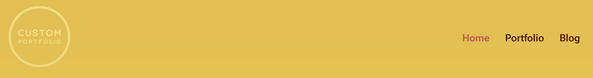

The image below shows the layout of the **primary navbar** at *the top of each page*, showing the **mobile view**.

The **mobile menu button**.

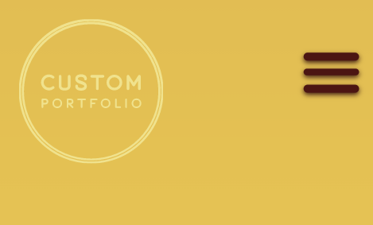

When **pressed reveals the menu** as shown below.

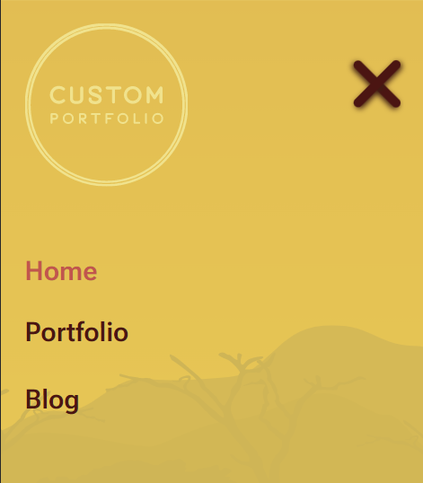


Below is a code snippet of the **breadcrumb navbar** that appears at *the footer of each page*.

```

<!-- Bottom Navbar Content starts here -->
<article id="breadcrumb" class="pt-pb">
    <h6 class="pb-1">Pages</h6>
    <nav>
        <ul class="breadcrumb" id="breadcrumbList">
            <li class="breadcrumb-link"><a href="home.html" class="active-breadcrumb-link-item">&raquo; Home</a></li>
            <li class="breadcrumb-link"><a href="portfolio.html" class="breadcrumb-link-item">&raquo; Portfolio</a></li>
            <li class="breadcrumb-link"><a href="blog.html" class="breadcrumb-link-item">&raquo; Blog</a></li>
        </ul>
    </nav>
</article>
<!-- Bottom Navbar Content ends here -->
                        
```

The image below shows the layout of the **breadcrumb navbar** at *the footer of each page*, showing the **desktop view**.

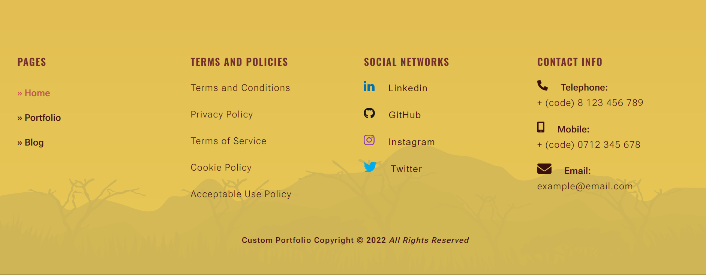

The image below shows the layout of the **breadcrumb navbar** at *the footer of each page*, showing the **mobile view**.

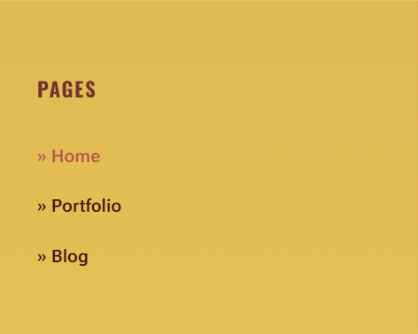

## The Design Process

### Ideation

**Ideation** is the creative process that heavily deals with *brainstorming ideas around a particular topic or challenge*. This process involves starting with the **main idea** in the centre and **finding connections** linking to it. The term **idea** represents an *element of thought* which can take the form of an **actual** or **abstract object**. A practical example of this is a **mind map**. 

### Wireframing

A Wireframe is the initial **blueprint** of a **digital product**. These digital products take various forms, such as websites, apps, games, and pieces of software. In essence, wireframes comprise **illustrations** which use *lines, shapes, and annotations* to explain the functionality of the components. Wireframes typically take one of two forms **paper** and **digital wireframes**. As the name suggests, *paper wireframes employ the use of sketching an idea on paper*. On the other hand, *digital wireframes use software that enables scribbling on a smartphone, tablet or pc using a stylus or mouse*.


Below is a **wireframe** of the **Landing Page** for this *Custom Portfolio* site

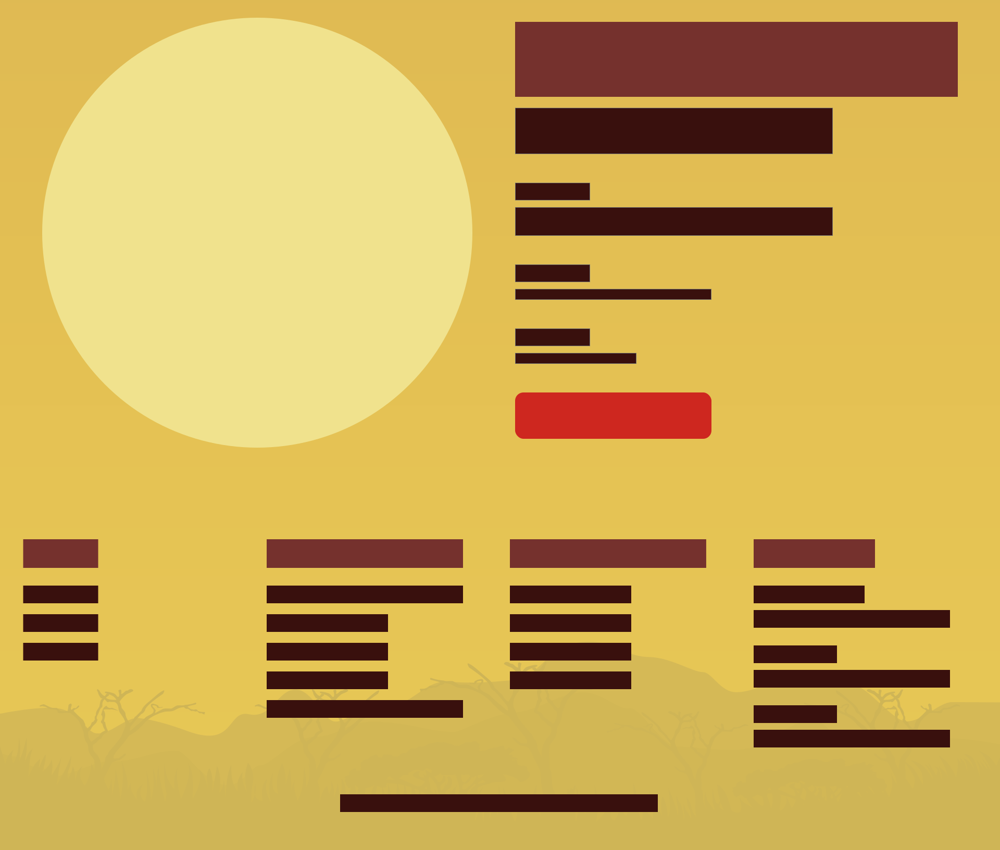

Below is a **wireframe** of the **Homepage** for this *Custom Portfolio* site

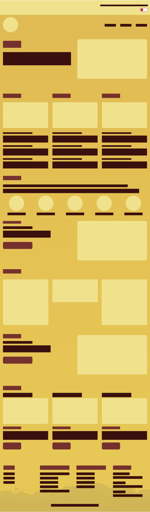

Below is a **wireframe** of the **Portfolio Page** for this *Custom Portfolio* site.

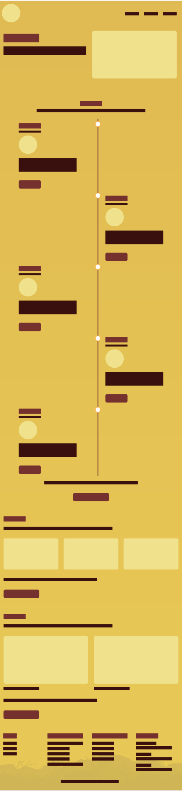

Below is a **wireframe** of the **Blog Page** for this *Custom Portfolio* site.

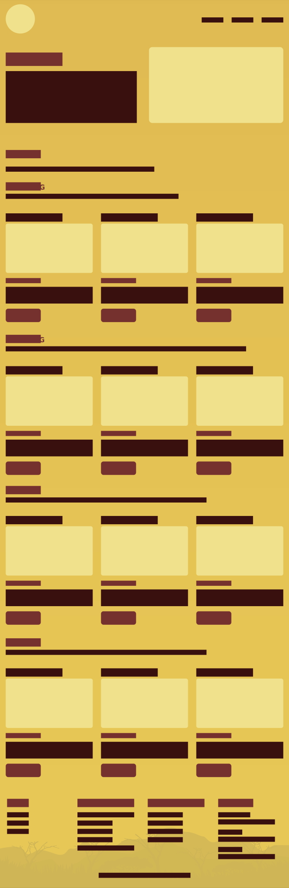


### Mockups

Mockups give an **accurate representation** of how a **final digital product** will look. At this stage of development, the illustrations contain *more details* regarding the design outlook. Mockups tend to make use of use *colour* and *contrast*. The content includes *texts, images, videos, thumbnails, icons* and other design details to enable **would-be users** and **stakeholders** to *visualize the product* through **high-fidelity designs**.


Below is a **mockup** of the **Landing Page** for this *Custom Portfolio* site

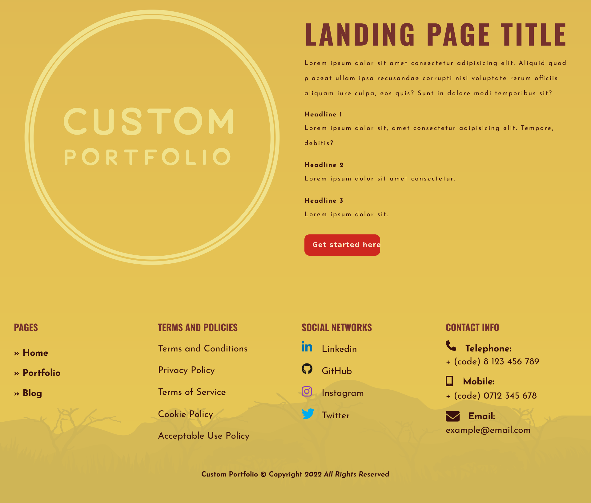

Below is a **mockup** of the **Homepage** for this *Custom Portfolio* site

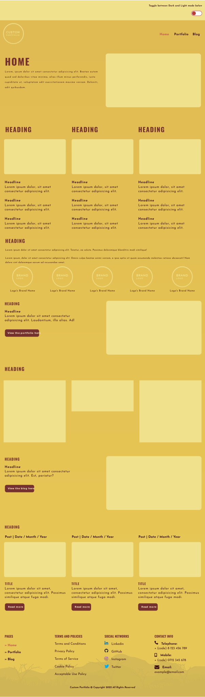

Below is a **mockup** of the **Portfolio Page** for this *Custom Portfolio* site.

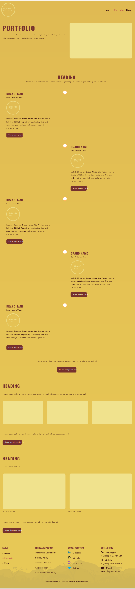

Below is a **mockup** of the **Blog Page** for this *Custom Portfolio* site.

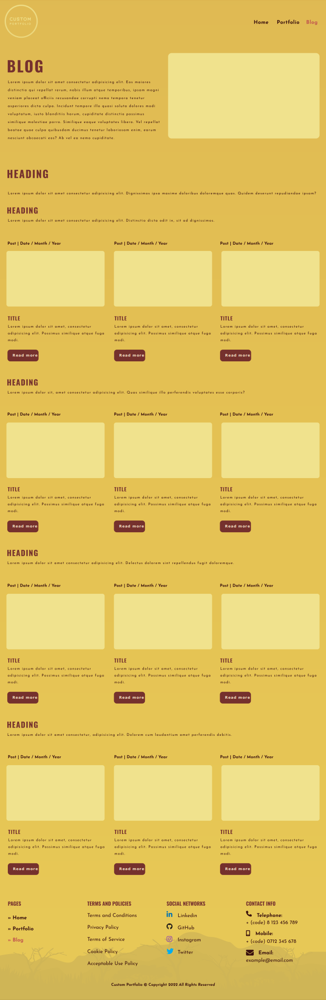

### Prototyping

A prototype is a sample version of a final product. Principally this is the product in its final design layout where the teams responsible get to evaluate the product before launch. The key distinguishing factor that separates a *prototype*, a *mockup* or *wireframe* is the introduction of *functionality* to a screen. In this context, **functionality** includes actions such as a *click, tap, swipe or press* that create an **interaction** between a **user** and a **product**. Prototypes come in two forms, **low-fidelity prototypes** and **High-fidelity prototypes**. 

## Features

### Existing Features

The features on this site include a timeline of projects, a gallery to showcase graphics and images, as well as a collection of blog posts. 

**Feature &mdash; Timeline of Web Dev Projects**
*Allows the user to see a timeline of Web Development Projects.*

```

<!-- Projects Timeline content start here -->
<div class="timeline">
    <div class="timeline-content-container timeline-content-left">
        <div class="pr-1 pl-1">
            <!-- Project 1 content starts here -->
            <article id="project1" class="timeline-content">
                <h3>Brand Name</h3>
                <strong>05 &#8725; October &#8725; 2022</strong>
                <figure class="pt-pb">
                    
                </figure>
                <p class="pb-1">Included here are <strong><a href="#" rel="noreferrer" class="site-preview-link">Brand Name Site Preview</a></strong> and a link to a <strong><a href="https://github.com/mweusukurasa/my-personal-portfolio" rel="noreferrer" class="site-preview-link">GitHub Repository</a></strong> containing <strong>files</strong> and <strong>code</strong> that you can <strong>fork</strong> and make up your portfolio site similar to this.</p>
                <div class="pt-1 pb-1">
                    <a href="#" class="button" role="button">View more info</a>
                </div>
            </article>
            <!-- Project 1 content ends here -->
        </div>
    </div>
    <div class="timeline-content-container timeline-content-right">
        <div class="pr-1 pl-1">
            <!-- Project 2 content starts here -->
            <article id="project2" class="timeline-content">
                <h3>Brand Name</h3>
                <strong>05 &#8725; October &#8725; 2022</strong>
                <figure class="pt-pb">
                    
                </figure>
                <p class="pb-1">Included here are <strong><a href="#" rel="noreferrer" class="site-preview-link">Brand Name Site Preview</a></strong> and a link to a <strong><a href="https://github.com/mweusukurasa/portfolio-site" rel="noreferrer" class="site-preview-link">GitHub Repository</a></strong> containing <strong>files</strong> and <strong>code</strong> that you can <strong>fork</strong> and make up your portfolio site similar to this.</p>
                <div class="pt-1 pb-1">
                    <a href="#" class="button" role="button">View more info</a>
                </div>
            </article>
            <!-- Project 2 content ends here -->
        </div>
    </div>
    <div class="timeline-content-container timeline-content-left">
        <div class="pr-1 pl-1">
            <!-- Project 3 content starts here -->
            <article id="project3" class="timeline-content">
                <h3>Brand Name</h3>
                <strong>05 &#8725; October &#8725; 2022</strong>
                <figure class="pt-pb">
                    
                </figure>
                <p class="pb-1">Included here are <strong><a href="#" rel="noreferrer" class="site-preview-link">Brand Name Site Preview</a></strong> and a link to a <strong><a href="#" rel="noreferrer" class="site-preview-link">GitHub Repository</a></strong> containing <strong>files</strong> and <strong>code</strong> that you can <strong>fork</strong> and make up your site similar to this.</p>
                <div class="pt-1 pb-1">
                    <a href="#" class="button" role="button">View more info</a>
                </div>
            </article>
            <!-- Project 3 content ends here -->
        </div>
    </div>
    <div class="timeline-content-container timeline-content-right">
        <div class="pr-1 pl-1">
            <!-- Project 4 content starts here -->
            <article id="project4" class="timeline-content">
                <h3>Brand Name</h3>
                <strong>05 &#8725; October &#8725; 2022</strong>
                <figure class="pt-pb">
                    
                </figure>
                <p class="pb-1">Included here are <strong><a href="#" rel="noreferrer" class="site-preview-link">Brand Name Site Preview</a></strong> and a link to a <strong><a href="#" rel="noreferrer" class="site-preview-link">GitHub Repository</a></strong> containing <strong>files</strong> and <strong>code</strong> that you can <strong>fork</strong> and make up your portfolio site similar to this.</p>
                <div class="pt-1 pb-1">
                    <a href="#" class="button" role="button">View more info</a>
                </div>
            </article>
            <!-- Project 4 content ends here -->
        </div>
    </div>
    <div class="timeline-content-container timeline-content-left">
        <div class="pr-1 pl-1">
            <!-- Project 5 content starts here -->
            <article id="project5" class="timeline-content">
                <h3>Brand Name</h3>
                <strong>05 &#8725; October &#8725; 2022</strong>
                <figure class="pt-pb">
                    
                </figure>
                <p class="pb-1">Included here are <strong><a href="#" rel="noreferrer" class="site-preview-link">Brand Name Site Preview</a></strong> and a link to a <strong><a href="#" rel="noreferrer" class="site-preview-link">GitHub Repository</a></strong> containing <strong>files</strong> and <strong>code</strong> that you can <strong>fork</strong> and make up your site similar to this.</p>
                <div class="pt-1 pb-1">
                    <a href="#" class="button" role="button">View more info</a>
                </div>
            </article>
            <!-- Project 5 content ends here -->
        </div>
    </div>
    <div class="timeline-content-container timeline-content-right">
        <div class="pr-1 pl-1">
            <!-- Project 6 content starts here -->
            <article id="project6" class="timeline-content">
                <h3>Brand Name</h3>
                <strong>05 &#8725; October &#8725; 2022</strong>
                <figure class="pt-pb">
                    
                </figure>
                <p class="pb-1">Included here are <strong><a href="#" rel="noreferrer" class="site-preview-link">Brand Name Site Preview</a></strong> and a link to a <strong><a href="#" rel="noreferrer" class="site-preview-link">GitHub Repository</a></strong> containing <strong>files</strong> and <strong>code</strong> that you can <strong>fork</strong> and make up your portfolio site similar to this.</p>
                <div class="pt-1 pb-1">
                    <a href="#" class="button" role="button">View more info</a>
                </div>
            </article>
            <!-- Project 6 content ends here -->
        </div>
    </div>
    <div class="timeline-content-container timeline-content-left">
        <div class="pr-1 pl-1">
            <!-- Project 7 content starts here -->
            <article id="project7" class="timeline-content">
                <h3>Brand Name</h3>
                <strong>05 &#8725; October &#8725; 2022</strong>
                <figure class="pt-pb">
                    
                </figure>
                <p class="pb-1">Included here are <strong><a href="#" rel="noreferrer" class="site-preview-link">Brand Name Site Preview</a></strong> and a link to a <strong><a href="#" rel="noreferrer" class="site-preview-link">GitHub Repository</a></strong> containing <strong>files</strong> and <strong>code</strong> that you can <strong>fork</strong> and make up your site similar to this.</p>
                <div class="pt-1 pb-1">
                    <a href="#" class="button" role="button">View more info</a>
                </div>
            </article>
            <!-- Project 7 content ends here -->
        </div>
    </div>
    <div class="timeline-content-container timeline-content-right">
        <div class="pr-1 pl-1">
            <!-- Project 8 content starts here -->
            <article id="project8" class="timeline-content">
                <h3>Brand Name</h3>
                <strong>05 &#8725; October &#8725; 2022</strong>
                <figure class="pt-pb">
                    
                </figure>
                <p class="pb-1">Included here are <strong><a href="#" rel="noreferrer" class="site-preview-link">Brand Name Site Preview</a></strong> and a link to a <strong><a href="#" rel="noreferrer" class="site-preview-link">GitHub Repository</a></strong> containing <strong>files</strong> and <strong>code</strong> that you can <strong>fork</strong> and make up your portfolio site similar to this.</p>
                <div class="pt-1 pb-1">
                    <a href="#" class="button" role="button">View more info</a>
                </div>
            </article>
            <!-- Project 8 content ends here -->
        </div>
    </div>
    <div class="timeline-content-container timeline-content-left">
        <div class="pr-1 pl-1">
            <!-- Project 9 content starts here -->
            <article id="project9" class="timeline-content">
                <h3>Brand Name</h3>
                <strong>05 &#8725; October &#8725; 2022</strong>
                <figure class="pt-pb">
                    
                </figure>
                <p class="pb-1">Included here are <strong><a href="#" rel="noreferrer" class="site-preview-link">Brand Name Site Preview</a></strong> and a link to a <strong><a href="#" rel="noreferrer" class="site-preview-link">GitHub Repository</a></strong> containing <strong>files</strong> and <strong>code</strong> that you can <strong>fork</strong> and make up your site similar to this.</p>
                <div class="pt-1 pb-1">
                    <a href="#" class="button" role="button">View more info</a>
                </div>
            </article>
            <!-- Project 9 ends here -->
        </div>
    </div>
    <div class="timeline-content-container timeline-content-right">
        <div class="pr-1 pl-1">
            <!-- Project 10 content starts here -->
            <article id="project10" class="timeline-content">
                <h3>Brand Name</h3>
                <strong>05 &#8725; October &#8725; 2022</strong>
                <figure class="pt-pb">
                    
                </figure>
                <p class="pb-1">Included here are <strong><a href="#" rel="noreferrer" class="site-preview-link">Brand Name Site Preview</a></strong> and a link to a <strong><a href="#" rel="noreferrer" class="site-preview-link">GitHub Repository</a></strong> containing <strong>files</strong> and <strong>code</strong> that you can <strong>fork</strong> and make up your portfolio site similar to this.</p>
                <div class="pt-1 pb-1">
                    <a href="#" class="button" role="button">View more info</a>
                </div>
            </article>
            <!-- Project 10 content ends here -->
        </div>
    </div>
    <div class="timeline-content-container timeline-content-left">
        <div class="pr-1 pl-1">
            <!-- Project 11 content starts here -->
            <article id="project11" class="timeline-content">
                <h3>Brand Name</h3>
                <strong>05 &#8725; October &#8725; 2022</strong>
                <figure class="pt-pb">
                    
                </figure>
                <p class="pb-1">Included here are <strong><a href="#" rel="noreferrer" class="site-preview-link">Brand Name Site Preview</a></strong> and a link to a <strong><a href="#" rel="noreferrer" class="site-preview-link">GitHub Repository</a></strong> containing <strong>files</strong> and <strong>code</strong> that you can <strong>fork</strong> and make up your site similar to this.</p>
                <div class="pt-1 pb-1">
                    <a href="#" class="button" role="button">View more info</a>
                </div>
            </article>
            <!-- Project 11 content ends here -->
        </div>
    </div>
</div>
<!-- Projects timeline content ends here -->
                        
```

**Feature &mdash; Gallery of Graphic Design Projects**
*Allows the user to see a collection of Graphic Design Projects.*

```

<!-- Graphic Design projects content starts here -->
<article class="pt-2 pb-2">
    <h2 class="pb-2 text-center">Heading</h2>
    <p class="pb-2 full-length-text text-center">Lorem ipsum, dolor sit amet consectetur adipisicing.</p>
    <section>
        <div>
            <h3>Heading</h3>
                <p class="pb-2 full-length-text">Lorem, ipsum dolor sit amet consectetur adipisicing elit.</p>
        </div>
        <!-- Poster graphics content starts here -->
        <div class="two-columns">
            <!-- Graphic Design project content starts here -->
            <div class="pt-1 pb-1">
                <figure>
                    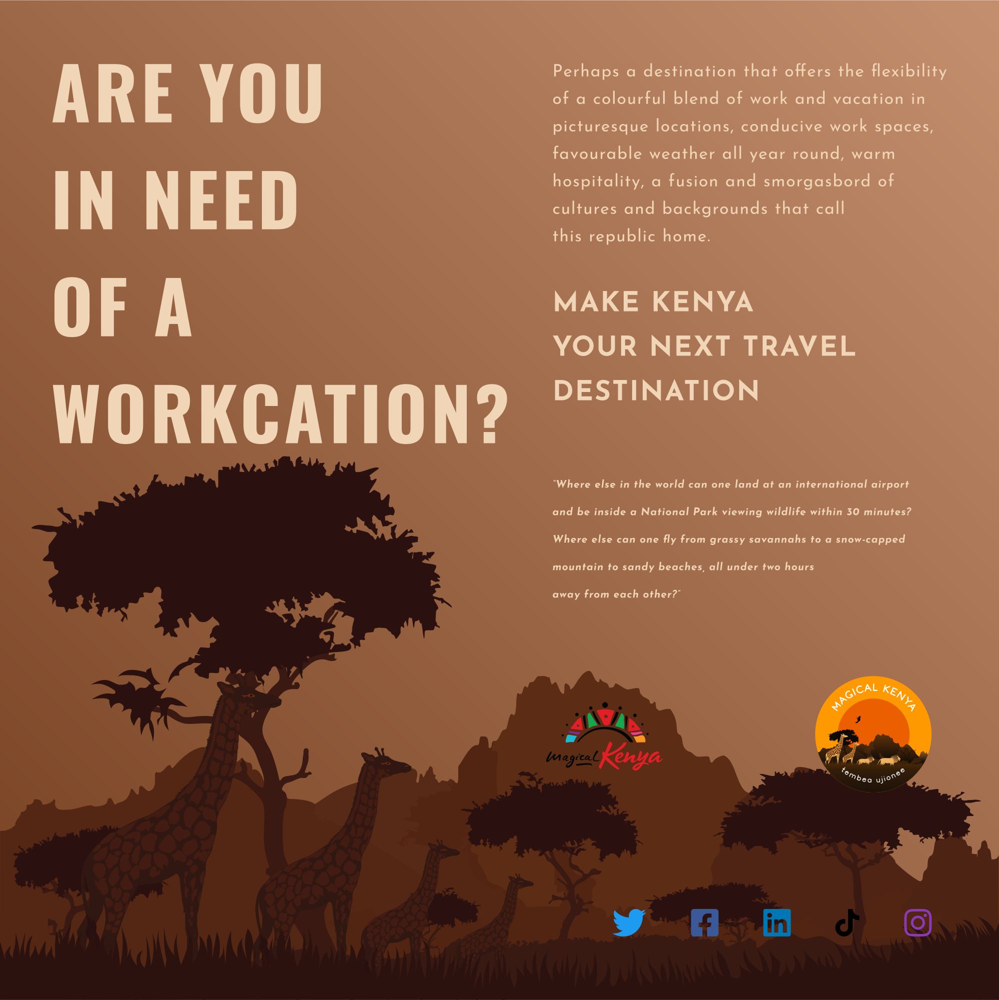
                </figure>
            </div>
            <!-- Graphic Design project content ends here -->
            <!-- Graphic Design project content starts here -->
            <div class="pt-1 pb-1">
                <figure>
                    
                </figure>
            </div>
            <!-- Graphic Design project content ends here -->
            <!-- Graphic Design project content starts here -->
            <div class="pt-1 pb-1">
                <figure>
                    
                </figure>
            </div>
            <!-- Graphic Design project content ends here -->
        </div>
        <!-- Poster graphics content ends here -->
    </section>
    <section class="pt-3">
        <div>
            <h3>Heading</h3>
            <p class="pb-2 full-length-text">Lorem ipsum dolor sit amet consectetur adipisicing elit.</p>
        </div>
        <!-- Illustration graphics content starts here -->
        <div class="two-columns">
            <!-- Graphic Design project content starts here -->
            <div class="pt-1 pb-1">
                <figure>
                    
                </figure>
            </div>
            <!-- Graphic Design project content ends here -->
            <!-- Graphic Design project content starts here -->
            <div class="pt-1 pb-1">
                <figure>
                    
                </figure>
            </div>
            <!-- Graphic Design project content ends here -->
            <!-- Graphic Design project content starts here -->
            <div class="pt-1 pb-1">
                <figure>
                    
                </figure>
            </div>
            <!-- Graphic Design project content ends here -->
        </div>
        <!-- Illustration graphics content ends here -->
    </section>
    <section class="pt-3">
        <div>
            <h3>Heading</h3>
            <p class="pb-2 full-length-text">Lorem ipsum dolor sit amet consectetur adipisicing elit.</p>
        </div>
        <!-- Booklets graphics content starts here -->
        <div class="two-columns">
            <!-- Graphic Design project content starts here -->
            <div class="pt-1 pb-1">
                <figure>
                    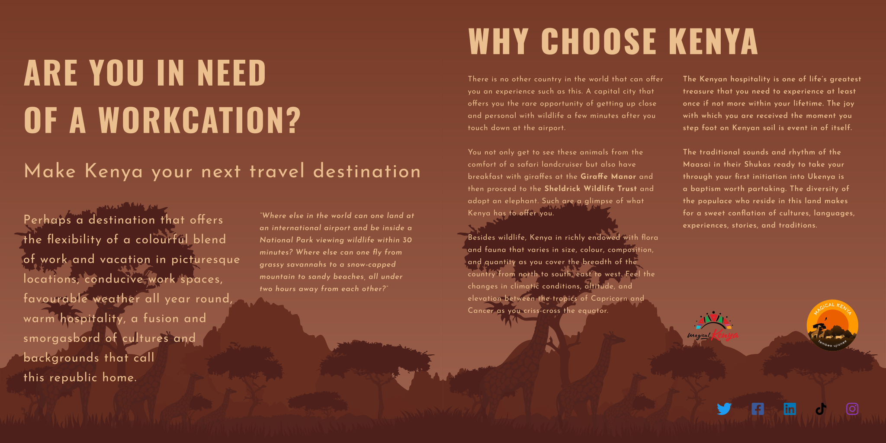
                </figure>
            </div>
            <!-- Graphic Design project content ends here -->
            <!-- Graphic Design project content starts here -->
            <div class="pt-1 pb-1">
                <figure>
                    
                </figure>
            </div>
            <!-- Graphic Design project content ends here -->
            <!-- Graphic Design project content starts here -->
            <div class="pt-1 pb-1">
                <figure>
                    
                </figure>
            </div>
            <!-- Graphic Design project content ends here -->
        </div>
        <!-- Booklets graphics content ends here -->
    </section>
    <div class="pt-3 pb-2">
        <p class="pb-2 full-length-text">Lorem ipsum, dolor sit amet consectetur adipisicing elit. Fugiat beatae dolore quidem quisquam quasi aliquid ipsa nulla excepturi itaque dolor, adipisci corporis non maiores eius. Dicta, doloremque. Nostrum illo tempore quibusdam fuga alias odio quidem!</p>
        <div class="pt-1 pb-1">
            <a href="portfolio.html" class="button" role="button">Back to portfolio</a>
        </div>
    </div>
</article>
<!-- Graphic Design projects content ends here -->
                        
```

**Feature &mdash; Images Gallery**
*Allows the user to see a collection of images.*

```

<!-- Images projects content starts here -->
<article class="pt-2 pb-2">
    <div class="text-center"></div>
    <h2 class="pb-2 text-center">Heading</h2>
    <p class="pb-2 full-length-text text-center">Lorem ipsum dolor sit amet consectetur adipisicing elit. Labore, alias velit sint aut quo aliquid vel corporis itaque.</p>
    <section>
        <div>
            <h3>Heading</h3>
            <p class="pb-2 full-length-text">Lorem ipsum dolor sit amet consectetur adipisicing elit. Possimus voluptate odio asperiores omnis!</p>
        </div>
        <!-- Images content starts here -->
        <div class="two-columns">
            <!-- Images project content starts here -->
            <div class="pt-1 pb-1">
                <figure>
                    
                </figure>
            </div>
            <!-- Images project content ends here -->
            <!-- Images project content starts here -->
            <div class="pt-1 pb-1">
                <figure>
                    
                </figure>
            </div>
            <!-- Images project content ends here -->
            <!-- Images project content starts here -->
            <div class="pt-1 pb-1">
                <figure>
                    
                </figure>
            </div>
            <!-- Images project content ends here -->
        </div>
        <!-- Images content ends here -->
    </section>
    <section class="pt-3">
        <div>
            <h3>Heading</h3>
            <p class="pb-2 full-length-text">Lorem ipsum dolor sit amet consectetur adipisicing elit. Adipisci quis itaque fuga libero.</p>
        </div>
        <!-- Images content starts here -->
        <div class="two-columns">
            <!-- Images project content starts here -->
            <div class="pt-1 pb-1">
                <figure>
                    
                </figure>
            </div>
            <!-- Images project content ends here -->
            <!-- Images project content starts here -->
            <div class="pt-1 pb-1">
                <figure>
                    
                </figure>
            </div>
            <!-- Images project content ends here -->
            <!-- Images project content starts here -->
            <div class="pt-1 pb-1">
                <figure>
                    
                </figure>
            </div>
            <!-- Images project content ends here -->
        </div>
        <!-- Images content ends here -->
    </section>
    <section class="pt-3">
        <div>
            <h3>Heading</h3>
            <p class="pb-2 full-length-text">Lorem ipsum dolor sit amet consectetur adipisicing elit. Sapiente voluptatum voluptate quo laborum exercitationem beatae distinctio velit quis quam!</p>
        </div>
        <!-- Images content starts here -->
        <div class="two-columns">
            <!-- Images project content starts here -->
            <div class="pt-1 pb-1">
                <figure>
                    
                </figure>
            </div>
            <!-- Images project content ends here -->
            <!-- Images project content starts here -->
            <div class="pt-1 pb-1">
                <figure>
                    
                </figure>
            </div>
            <!-- Images project content ends here -->
            <!-- Images project content starts here -->
            <div class="pt-1 pb-1">
                <figure>
                    
                </figure>
            </div>
            <!-- Images project content ends here -->
        </div>
        <!-- Images content ends here -->
    </section>
    <div class="pt-3 pb-2">
        <p class="pb-2 full-length-text">Lorem ipsum dolor sit, amet consectetur adipisicing elit. Recusandae ipsum corrupti tenetur sit suscipit? Magni similique officiis adipisci pariatur architecto porro, aspernatur, accusantium autem totam facilis est molestias aut, id quisquam placeat blanditiis veritatis?</p>
        <div class="pt-1 pb-1">
            <a href="portfolio.html" class="button" role="button">Back to portfolio</a>
        </div>
    </div>
</article>
<!-- Images projects content ends here -->
                        
```

**Feature - Collection of Blog Posts** 
*Allows the user to get a glimpse of the kind of content that is associated with that blog postcard.*

```

<!-- Blog content starts here -->
<article class="pt-2 pb-2">
    <h2 class="pb-2">Heading</h2>
    <p class="pb-2 full-length-text">Lorem ipsum dolor sit amet consectetur adipisicing elit. Dignissimos ipsa maxime doloribus doloremque quas. Quidem deserunt repudiandae ipsam?</p>
    <section>
        <div>
            <h3>Heading</h3>
            <p class="pb-2 full-length-text">Lorem ipsum dolor sit amet consectetur adipisicing elit. Distinctio dicta odit in, sit ad dignissimos.</p>
        </div>
        <!-- Blog content starts here -->
        <div class="two-columns">
            <!-- Blog post content starts here-->
            <div id="blogPost1" class="pt-2">
                <strong>Post &VerticalLine; Date &#8725; Month &#8725; Year</strong>
                <figure class="pt-1 pb-1">
                    
                </figure>
                <h4>Title</h4>
                <p class="pb-2">Lorem ipsum dolor sit amet, consectetur adipisicing elit. Possimus similique atque fuga modi.</p>
                <div class="pb-1">
                    <a href="#" role="button" class="button">Read more</a>
                </div>
            </div>
            <!-- Blog post content ends here -->
            <!-- Blog post content starts here-->
            <div id="blogPost2" class="pt-2">
                <strong>Post &VerticalLine; Date &#8725; Month &#8725; Year</strong>
                <figure class="pt-1 pb-1">
                    
                </figure>
                <h4>Title</h4>
                <p class="pb-2">Lorem ipsum dolor sit amet, consectetur adipisicing elit. Possimus similique atque fuga modi.</p>
                <div class="pb-1">
                    <a href="#" role="button" class="button">Read more</a>
                </div>
            </div>
            <!-- Blog post content ends here -->
            <!-- Blog post content starts here-->
            <div id="blogPost3" class="pt-2">
                <strong>Post &VerticalLine; Date &#8725; Month &#8725; Year</strong>
                <figure class="pt-1 pb-1">
                    
                </figure>
                <h4>Title</h4>
                <p class="pb-2">Lorem ipsum dolor sit amet, consectetur adipisicing elit. Possimus similique atque fuga modi.</p>
                <div class="pb-1">
                    <a href="#" role="button" class="button">Read more</a>
                </div>
            </div>
            <!-- Blog post content ends here -->
        </div>
        <!-- Blog content ends here -->
    </section>
    <section class="pt-3">
        <div>
            <h3>Heading</h3>
            <p class="pb-2 full-length-text">Lorem ipsum dolor sit, amet consectetur adipisicing elit. Quas similique illo perferendis voluptates esse corporis?</p>
        </div>
        <!-- Blog content starts here -->
        <div class="two-columns">
            <!-- Blog post content starts here-->
            <div id="blogPost4" class="pt-2">
                <strong>Post &VerticalLine; Date &#8725; Month &#8725; Year</strong>
                <figure class="pt-1 pb-1">
                    
                </figure>
                <h4>Title</h4>
                <p class="pb-2">Lorem ipsum dolor sit amet, consectetur adipisicing elit. Possimus similique atque fuga modi.</p>
                <div class="pb-1">
                    <a href="#" role="button" class="button">Read more</a>
                </div>
            </div>
            <!-- Blog post content ends here -->
            <!-- Blog post content starts here-->
            <div id="blogPost5" class="pt-2">
                <strong>Post &VerticalLine; Date &#8725; Month &#8725; Year</strong>
                <figure class="pt-1 pb-1">
                    
                </figure>
                <h4>Title</h4>
                <p class="pb-2">Lorem ipsum dolor sit amet, consectetur adipisicing elit. Possimus similique atque fuga modi.</p>
                <div class="pb-1">
                    <a href="#" role="button" class="button">Read more</a>
                </div>
            </div>
            <!-- Blog post content ends here -->
            <!-- Blog post content starts here-->
            <div id="blogPost6" class="pt-2">
                <strong>Post &VerticalLine; Date &#8725; Month &#8725; Year</strong>
                <figure class="pt-1 pb-1">
                    
                </figure>
                <h4>Title</h4>
                <p class="pb-2">Lorem ipsum dolor sit amet, consectetur adipisicing elit. Possimus similique atque fuga modi.</p>
                <div class="pb-1">
                    <a href="#" role="button" class="button">Read more</a>
                </div>
            </div>
            <!-- Blog post content ends here -->
        </div>
        <!-- Blog content ends here -->
    </section>
    <section class="pt-3">
        <div>
            <h3>Heading</h3>
            <p class="pb-2 full-length-text">Lorem ipsum dolor sit amet consectetur adipisicing elit. Delectus dolorem sint repellendus fugit doloremque.</p>
        </div>
        <!-- Blog content starts here -->
        <div class="two-columns">
            <!-- Blog post content starts here-->
            <div id="blogPost7" class="pt-2">
                <strong>Post &VerticalLine; Date &#8725; Month &#8725; Year</strong>
                <figure class="pt-1 pb-1">
                    
                </figure>
                <h4>Title</h4>
                <p class="pb-2">Lorem ipsum dolor sit amet, consectetur adipisicing elit. Possimus similique atque fuga modi.</p>
                <div class="pb-1">
                    <a href="#" role="button" class="button">Read more</a>
                </div>
            </div>
            <!-- Blog post content ends here -->
            <!-- Blog post content starts here-->
            <div id="blogPost8" class="pt-2">
                <strong>Post &VerticalLine; Date &#8725; Month &#8725; Year</strong>
                <figure class="pt-1 pb-1">
                    
                </figure>
                <h4>Title</h4>
                <p class="pb-2">Lorem ipsum dolor sit amet, consectetur adipisicing elit. Possimus similique atque fuga modi.</p>
                <div class="pb-1">
                    <a href="#" role="button" class="button">Read more</a>
                </div>
            </div>
            <!-- Blog post content ends here -->
            <!-- Blog post content starts here-->
            <div id="blogPost9" class="pt-2">
                <strong>Post &VerticalLine; Date &#8725; Month &#8725; Year</strong>
                <figure class="pt-1 pb-1">
                    
                </figure>
                <h4>Title</h4>
                <p class="pb-2">Lorem ipsum dolor sit amet, consectetur adipisicing elit. Possimus similique atque fuga modi.</p>
                <div class="pb-1">
                    <a href="#" role="button" class="button">Read more</a>
                </div>
            </div>
            <!-- Blog post content ends here -->
        </div>
        <!-- Blog content ends here -->
    </section>
    <section class="pt-3">
        <div>
            <h3>Heading</h3>
            <p class="pb-2 full-length-text">Lorem ipsum dolor sit amet consectetur, adipisicing elit. Dolorem cum laudantium amet perferendis debitis.</p>
        </div>
        <!-- Blog content starts here -->
        <div class="two-columns">
            <!-- Blog post content starts here-->
            <div id="blogPost10" class="pt-2">
                <strong>Post &VerticalLine; Date &#8725; Month &#8725; Year</strong>
                <figure class="pt-1 pb-1">
                    
                </figure>
                <h4>Title</h4>
                <p class="pb-2">Lorem ipsum dolor sit amet, consectetur adipisicing elit. Possimus similique atque fuga modi.</p>
                <div class="pb-1">
                    <a href="#" role="button" class="button">Read more</a>
                </div>
            </div>
            <!-- Blog post content ends here -->
            <!-- Blog post content starts here-->
            <div id="blogPost11" class="pt-2">
                <strong>Post &VerticalLine; Date &#8725; Month &#8725; Year</strong>
                <figure class="pt-1 pb-1">
                    
                </figure>
                <h4>Title</h4>
                <p class="pb-2">Lorem ipsum dolor sit amet, consectetur adipisicing elit. Possimus similique atque fuga modi.</p>
                <div class="pb-1">
                    <a href="#" role="button" class="button">Read more</a>
                </div>
            </div>
            <!-- Blog post content ends here -->
            <!-- Blog post content starts here-->
            <div id="blogPost12" class="pt-2">
                <strong>Post &VerticalLine; Date &#8725; Month &#8725; Year</strong>
                <figure class="pt-1 pb-1">
                    
                </figure>
                <h4>Title</h4>
                <p class="pb-2">Lorem ipsum dolor sit amet, consectetur adipisicing elit. Possimus similique atque fuga modi.</p>
                <div class="pb-1">
                    <a href="#" role="button" class="button">Read more</a>
                </div>
            </div>
            <!-- Blog post content ends here -->
        </div>
        <!-- Blog content ends here -->
    </section>
</article>
<!-- Blog content ends here -->
                        
```


## Technologies

### Typography

The font families used are: 

```

    - Roboto Flex
    - Oswald

```

**The font in use for headings**

```
Heading Font

    - Oswald

```

**The font in use for paragraphs**

```
Paragraph Font

    - Roboto Flex

```
To use the same combination of fonts click here to access the [Google Fonts Used](https://fonts.googleapis.com/css2?family=Oswald:wght@700&family=Roboto+Flex:opsz,wght@8..144,300;8..144,400;8..144,600&display=swap)


### Frontend Framework

There is no Frontend framework in use for this particular site.

### Backend Framework

There is no Backend framework in use for this particular site.

### Code Editor

The code editor of choice in use for this particular site project is [Visual Studio Code](https://code.visualstudio.com/).


## Testing

### Validator

This site uses HTML5 as the version of choice for HTML **Hyper Text Markup Language**. To access the validator for HTML5, click here [HTML5 Validator](https://html5.validator.nu/).

Below are the results after validating the HTML5 files on this site.

- [Landing Page HTML5 Validation Result](https://html5.validator.nu/?doc=https%3A%2F%2Fmweusukurasa.github.io%2Fcustom-portfolio%2Findex.html&showimagereport=yes&showsource=yes)

- [Home Page HTML5 Validation Result](https://html5.validator.nu/?doc=https%3A%2F%2Fmweusukurasa.github.io%2Fcustom-portfolio%2Fhome.html&showimagereport=yes&showsource=yes)

- [Portfolio Page HTML5 Validation Result](https://html5.validator.nu/?doc=https%3A%2F%2Fmweusukurasa.github.io%2Fcustom-portfolio%2Fportfolio.html&showimagereport=yes&showsource=yes)

- [Blog Page HTML5 Validation Result](https://html5.validator.nu/?doc=https%3A%2F%2Fmweusukurasa.github.io%2Fcustom-portfolio%2Fblog.html&showimagereport=yes&showsource=yes)

- [Graphic Design projects Page HTML5 Validation Result](https://mweusukurasa.github.io/custom-portfolio/graphic_design_projects.html)

- [Images Gallery Page HTML5 Validation Result](https://html5.validator.nu/?doc=https%3A%2F%2Fmweusukurasa.github.io%2Fcustom-portfolio%2Fimages_gallery.html&showimagereport=yes&showsource=yes)

- [Web Development Projects Page HTML5 Validation Result](https://html5.validator.nu/?doc=https%3A%2F%2Fmweusukurasa.github.io%2Fcustom-portfolio%2Fweb_development_projects.html&showimagereport=yes&showsource=yes)


This site uses CSS Level 3 as the version of choice for CSS **Cascading Style Sheet**. To access the validator for CSS, click here [CSS Validator](https://jigsaw.w3.org/css-validator/).

Below are the results after validating the HTML5 files on this site.

- [CSS Level 3 Validation Result](https://html5.validator.nu/)


### Digital

Concerning digital testing, two methods are in use. One is an in-browser testing, and the other is a non-in-browser testing method.

**In-Browser Testing**

When using the **Microsoft Edge Browser** and **Google Chrome Browser**, the in-built automated testing application Extention of choice is [Lighthouse ext](https://developers.google.com/web/tools/lighthouse#devtools)


**Non-In-Browser Testing**

[Lighthouse Metrics](https://lighthouse-metrics.com/) and [PageSpeed Insights](https://pagespeed.web.dev/) are the non-in-browser sites used to conduct testing of the site.


### Analogue

Analogue testing, which involves users interacting with the site, is vital feedback for the continuous improvement of the site. To achieve this, this family and friends got an opportunity to navigate through the website's content and provide valuable feedback both on PCs and smartphones.

## Deployment

**GitHub** is the platform for hosting the files that make up this site. Click here [Custom Portfolio GitHub Repository](https://github.com/mweusukurasa/custom-portfolio) to access the *GitHub repository* containing files for this site.

A live preview of what the site looks like can be found here [Custom Portfolio Live Demo](https://mweusukurasa.github.io/custom-portfolio/).

## Credits

The following is a compilation list of **inspirational sources** that are instrumental in the design of this project.

* [Fluid Typography](https://css-tricks.com/snippets/css/fluid-typography/) 
* [Favicon Generator](https://realfavicongenerator.net/)
* [Auto-fit vs Auto-fill](https://gridbyexample.com/examples/example37/)
* [Min & Max Content Sizing in CSS Grid — 1/3 Flexibility (Jen Simmons YouTube)](https://www.youtube.com/watch?v=lZ2JX_6SGNI)
* [FR Units in CSS Grid — 2/3 Flexibility (Jen Simmons YouTube)](https://www.youtube.com/watch?v=ZPtpzuRajzM)
* [MinMax in CSS Grid — 3/3 Flexibility (Jen Simmons YouTube)](https://www.youtube.com/watch?v=mVQiNpqXov8)
* [Symbols HTML code (Toptal Designers)](https://www.toptal.com/designers/htmlarrows/arrows/)


## Content

This site contains **illustrations, graphics, icons** and **favicons** in **SVG** Format **(Scaleable Vector Graphics)**. 

This site contains **illustrations, graphics, icons** and **favicons** drawn in **SVG** Format **(Scaleable Vector Graphics)**. The **software** in use is **Adobe XD**.


## Acknowledgements

I cannot express enough thanks to my family and friends for their continued support and encouragement throughout the making of this site project. They have been instrumental in giving tips regarding the **layout, colours, content,** and **user experience**. 